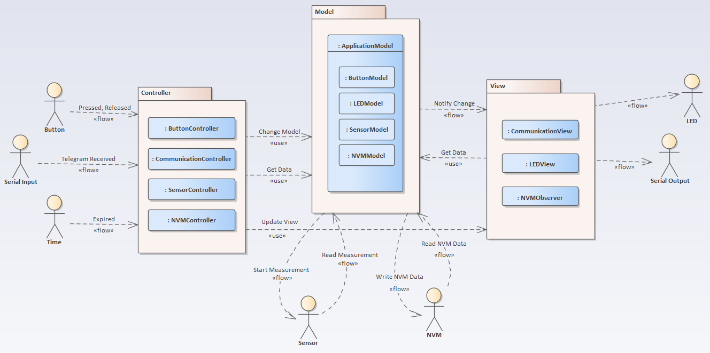
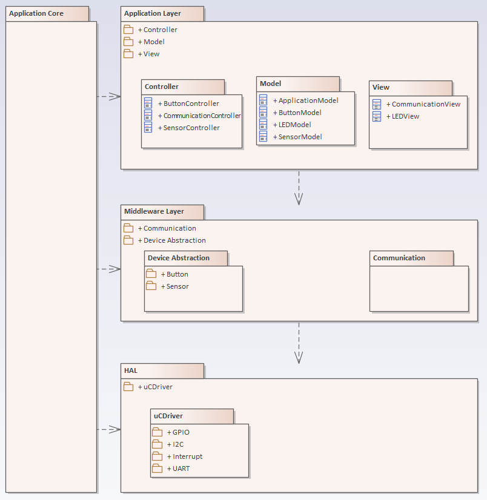

# MVC Pattern in Embedded Monolithic System (in progress!)
## Main Idea
How can the MVC pattern be implemented in a monolithic embedded system without a display? Which components can take the role of the Model, the View, and the Controller?

The idea of applying the MVC (Model–View–Controller) pattern to embedded systems originated from the book "Making Embedded Systems" by Alicia White. There is limited information available on the use of MVC in embedded software. However, one relevant article is "Model View Controller Architecture on Embedded Systems" by Abhishek Bajpai. A general definition of MVC can also be found in "Pattern-Oriented Software Architecture" by Frank Buschmann. The role of the Controller can also be derived from the GRASP (General Responsibility Assignment Software Patterns) principles.

## Overview of the MVC Pattern
The MVC pattern is typically described in the context of applications with user interfaces that include visual elements, i.e., applications featuring a graphical user interface (GUI). This document demonstrates how the MVC concept can be implemented in an embedded system that does not provide a GUI.

The MVC pattern defines a separation of responsibilities among input handling, business logic, and output generation. The following sections describe the typical roles of each component in a general MVC architecture.

### Controller
**•** Receives input from the user, external sources, or system events (in embedded systems: button presses, serial interface input, timers) 
**•** Interprets the input and triggers corresponding actions in the Model 
**•** Manages the control flow and determines when specific Model actions must be executed 

### Model
**•** Owns and manages the system data and/or implements the core business logic 
**•** Ensures data integrity and correctness 
**•** Notifies the View component about data changes 
**•** Defines how data should be processed and maintained 

### View
**•** Presents data to the user or an external interface (in embedded systems: LEDs, serial interface output, display indicators) 
**•** Formats data for presentation according to system requirements 

### Model–View Notification via Observer Pattern
The notification mechanism between the Model and the Views can be implemented using the Observer pattern.
All Views act as observers and must subscribe to the Model for the specific data they are interested in.
Whenever the relevant data in the Model changes, the Model notifies all subscribed Views, which can then retrieve and present the updated information.
See [Observer Pattern](https://github.com/brackal/Head-First-Design-Patterns-Cpp) resp. [Callback Pattern](https://github.com/brackal/Embedded-Design-Patterns/tree/main/CallbackPattern)

### Summary
In summary, the MVC pattern enables a clear separation of concerns in software design. When applied to embedded systems, it helps isolate hardware-dependent input/output handling (Controller and View) from the core logic (Model), thereby improving modularity, maintainability, and testability.

## Controller-Model–View Interaction in Embedded Context
The Controller receives input from the user or from other systems.
In this example, inputs are generated either by a button press or by a message (telegram) received via the serial interface. Each type of input is handled by a dedicated Controller.

**Controllers** interpret incoming inputs and determine what data needs to be modified in the Model.
They have both read and write access to the Model and trigger corresponding actions as required.
In some use cases, Controllers also need to retrieve data from the Model; in such cases, they can directly access the necessary information. 
Controllers also have access to the Views and can instruct them to visualize or present data when needed.

The **Model** (which may consist of a single entity or, as in this example, multiple sub-models) notifies all subscribed Views whenever its data or internal state changes.

Upon receiving such a notification, each **View** — which should have read-only access to the Model — retrieves the relevant data it is interested in and presents it accordingly. 
In this example, the LED functions as a visual element. The transfer of information itself can be considered a form of data representation.

##### Diagram Notation and Arrow Semantics
In this diagram, arrows labeled with the stereotype << flow >> represent the information flow from the source to the sink.
They do not indicate a structural dependency. For example, a Button does not depend on the Controller.
Arrows labeled with the stereotype << use >>, on the other hand, indicate a true structural dependency. 
For instance, a Controller depends on the Model, which means that in the implementation, the Controller must hold a reference to the Model.

## Extending MVC for Embedded System Complexity
That was relatively straightforward. Now, the situation becomes more complex.
How should components such as sensors or persistent storage be implemented? Which MVC component is responsible for interacting with these elements?

**Specifically:**  
**•** Is it the Controller’s responsibility to start a sensor measurement and read the sensor data, or does this fall under the Model’s responsibility? 
**•** Which component should manage persistent data: the Controller or the Model?

These questions must be addressed carefully to maintain a clear separation of concerns and ensure modularity and maintainability in the system architecture.

### Active vs. Passive Models
These questions can be addressed by understanding that Models can be either active or passive.

#### Passive Model
A passive Model is purely a data model: it stores data and may perform basic computations on the data. A passive Model does not have access to lower layers of the system.

**Use Case: Sensor** 
**•** The Sensor Controller determines when a measurement should be taken. 
**•** The Sensor Controller initiates the measurement on the sensor and reads the measurement values. 
**•** The Sensor Controller then updates the corresponding value in the Sensor Model (e.g., temperature). 
**•** The Model notifies subscribed observers, such as the Communication View, so that the value can be transmitted via the serial interface.

**Use Case: Persistence** 
**•** The NVM Controller determines when data should be read from persistent storage and updates the corresponding NVM Model. 
**•** The Model notifies subscribed NVM Observers (the term "observer" is used here to distinguish from Views). 
**•** The NVM Observer writes the data to the persistent storage.

**In summary:** 
**•** The Controller reads sensor or persistent data. 
**•** The Observer writes data to the persistent storage or handles data transmission.

#### Passive Model
An active Model is allowed to access lower-level system components directly.

**Use Case: Sensor** 
**•** The Sensor Controller determines when a measurement should be taken (e.g., every 60 seconds). 
**•** The Sensor Controller invokes the appropriate action on the Sensor Model (e.g., SensorModel.DoMeasurement()). 
**•** The Sensor Model itself initiates the measurement on the sensor and reads the measured values. 
**•** After updating its data, the Model notifies subscribed observers, such as the Communication View, so that the values can be transmitted via the serial interface.

**Use Case: Persistence** 
**•** The NVM Model autonomously determines when data needs to be read from or written to persistent storage and performs these operations independently. 
**•** In this scenario, neither an NVM Controller nor NVM Observers are required.

## Layer View

## todo

