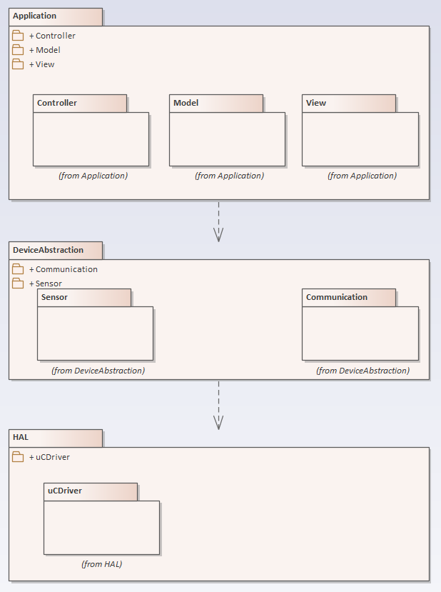

# MVC pattern in embedded monolithic system (in progress!)
## Main idea
How can the MVC pattern be implemented in a monolithic embedded system without a display? Which components can take the role of the Model, the View, and the Controller?

## Class view (in progress!)

## todo
